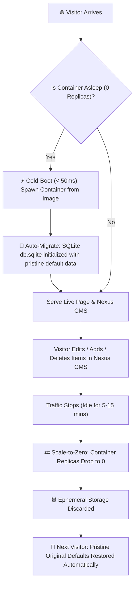

# 💼 Rullst Portfolio Blueprint Guide (`blueprints/portfolio`)

> **"Ultra-fast developer showcase with dark glassmorphic UI, pure server-side rendering, and zero JavaScript dependencies."**

The **Portfolio Blueprint** is an official application scaffold generated by the `cargo-rullst` CLI tool (`v12.0.0`). It showcases how to build and deploy an ultra-responsive, beautiful developer portfolio and curriculum vitae in pure Rust without front-end framework overhead.

---

## 🌟 Key Architecture & Features

| Dimension | Specification |
| :--- | :--- |
| **Framework Version** | **Rullst v12.0.0** (Official Stable) |
| **Rendering Engine** | **Zero-Bundle SSR** (`html!` procedural macro + HTMX 1.9.12) |
| **ORM & Database** | **Active Record ORM** with **SQLite 3** (`mode=rwc`) |
| **Styling & Aesthetics** | **Pure CSS Dark Glassmorphism** (Zero NPM, zero Node.js build pipeline) |
| **Typography** | Google Fonts `Outfit` (Modern geometric sans-serif) |
| **Admin Control** | 🛡️ **Nexus Admin CMS** auto-generated CRUD at `/nexus` |
| **Telemetry Cockpit** | 🚀 **Studio Data Browser** at `/studio` |
| **Footprint** | **~15 MB idle RAM**, sub-millisecond TTFB, < 50ms cold-start wake-up |
| **Cloud Target** | **Azure Container Apps** Serverless Consumption Tier (**$0.00 / month**) |

---

## 🏛️ Domain Models (Active Record ORM)

The Portfolio Blueprint models a complete professional CV and developer portfolio via 4 Active Record entities:

1. **`Profile` (`profiles` table):**
   - Personal biographical details: `name`, `title`, `subtitle`, `email`, `website`, `avatar_url`, `github_url`, `linkedin_url`.
2. **`Project` (`projects` table):**
   - Software portfolio entries: `title`, `description`, `url`, `tags`, `is_featured`.
3. **`Experience` (`experiences` table):**
   - Career timeline items: `role`, `company`, `period`, `description`.
4. **`Skill` (`skills` table):**
   - Categorized technical abilities: `name`, `category` (Languages, Frameworks, Database, DevOps).

---

## 🛡️ Control Centers: Nexus CMS & Studio Cockpit

The portfolio embeds two administrative interfaces mounted directly on the primary HTTP listener:

### 1. ⚙️ Nexus Admin CMS (`/nexus`)
Auto-generated administrative CRUD dashboard for all 4 domain models:
- Add, update, and reorder projects, career timeline items, and skills on the fly.
- Edit profile biographical information and links without modifying source code.

### 2. 🚀 Studio Cockpit (`/studio`)
Live system telemetry and developer control room:
- Interactive SQLite table data browser.
- Live query profiler and execution latency metrics.
- Threat radar and runtime application security (RASP) telemetry.

### 🔑 Public Sandbox Credentials
For public demonstrations and showcases, the application includes a sandbox access policy:
- **Username:** `admin` (or configured via `NEXUS_ADMIN_USERNAME`)
- **Password:** `SovereignPortfolio2026!` (or configured via `NEXUS_ADMIN_PASSWORD`)

Protected by HTTP Basic Auth and verified through `NexusVerifiedTls::from_trusted_tls_termination()`.

---

## 🔄 Ephemeral Scale-to-Zero Lifecycle (Sandbox Safety)

On **Azure Container Apps**, the Portfolio runs under the Serverless Consumption Tier:



### Why this is a Superpower:
- **Zero Ongoing Cost:** Replicas automatically scale to `0` when idle, consuming $0.00 of cloud credits.
- **Worry-Free Public Demo:** Anyone can freely experiment with the Nexus CMS, create projects, or delete skills. As soon as the container shuts down from inactivity, the next cold-boot automatically rebuilds the database and seeds the original portfolio defaults!

---

## 🚀 Running Locally

### 1. Run the Portfolio Server
```bash
cd blueprints/portfolio
cargo run
```

### 2. Access Local Endpoints:
- 🌐 **Portfolio UI:** [http://127.0.0.1:3000](http://127.0.0.1:3000)
- ⚙️ **Nexus Admin CMS:** [http://127.0.0.1:3000/nexus](http://127.0.0.1:3000/nexus)
- 🚀 **Studio Cockpit:** [http://127.0.0.1:3000/studio](http://127.0.0.1:3000/studio)

---

## ☁️ Deploying to Azure Container Apps

### 1. Azure CLI Command
```bash
az containerapp create \
  --name rullst-portfolio \
  --resource-group rullst-rg \
  --environment managedEnvironment-rullst \
  --image ghcr.io/rullst/portfolio:latest \
  --target-port 3000 \
  --ingress external \
  --min-replicas 0 \
  --max-replicas 1 \
  --cpu 0.25 \
  --memory 0.5Gi \
  --env-vars \
    HOST=0.0.0.0 \
    PORT=3000 \
    RULLST_ENV=production \
    DATABASE_URL="sqlite:///app/db.sqlite?mode=rwc" \
    NEXUS_ADMIN_USERNAME=admin \
    NEXUS_ADMIN_PASSWORD="SovereignPortfolio2026!"
```

### 2. Automated GitHub Actions CI/CD
Whenever changes are pushed to `blueprints/portfolio/**` on the `main` branch, [.github/workflows/deploy-portfolio.yml](file:///.github/workflows/deploy-portfolio.yml) builds the OCI container with `cargo-chef` cache and deploys the new revision to Azure.
